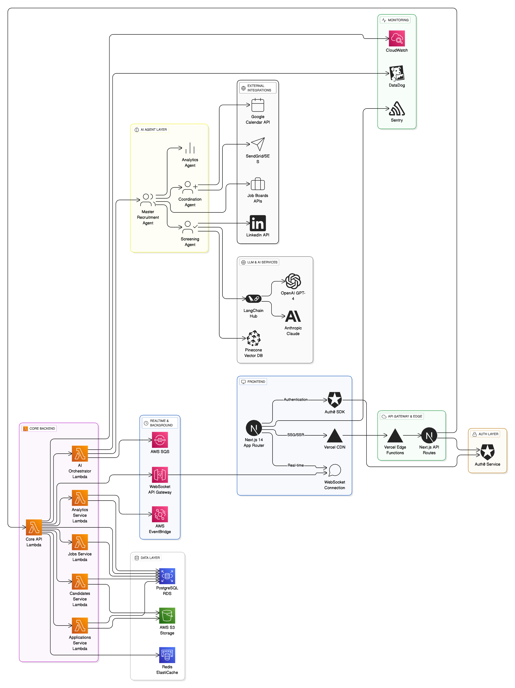
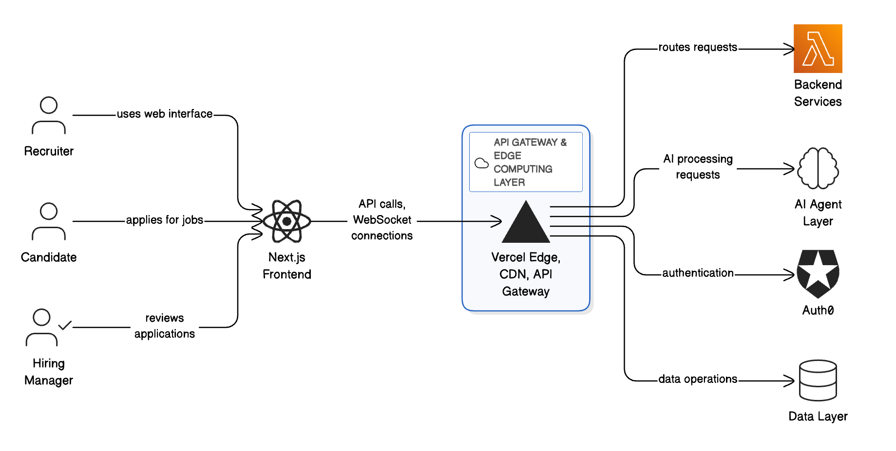
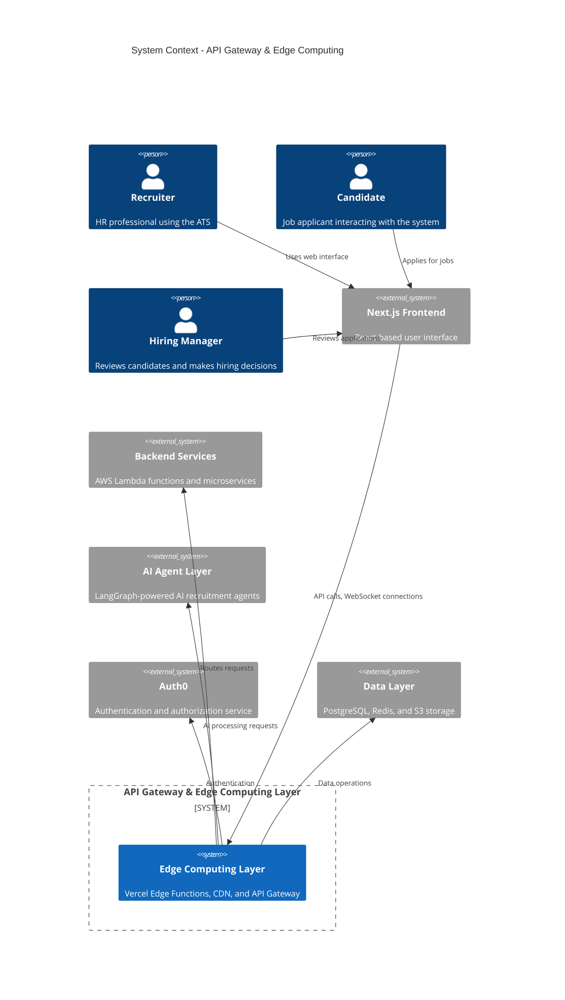
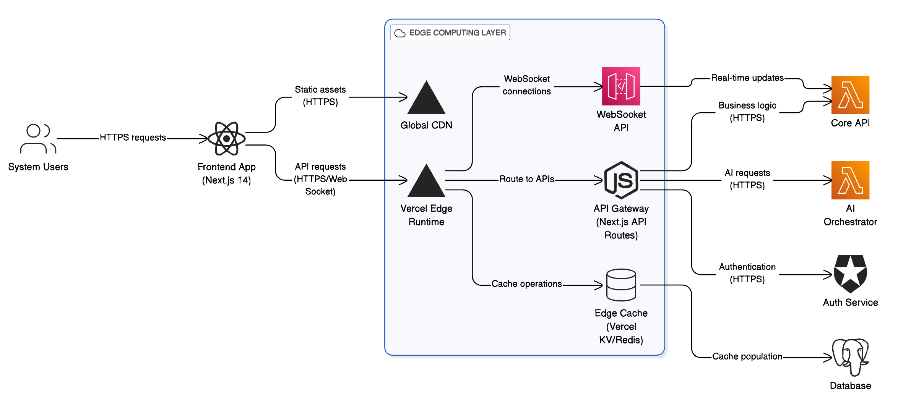
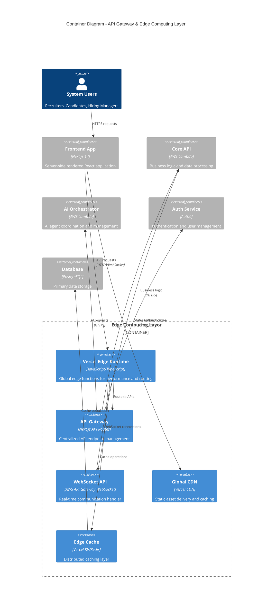
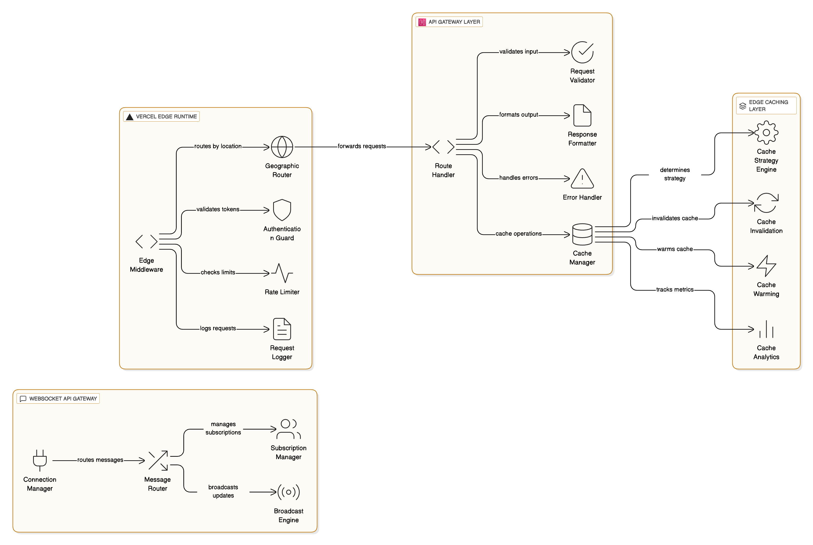
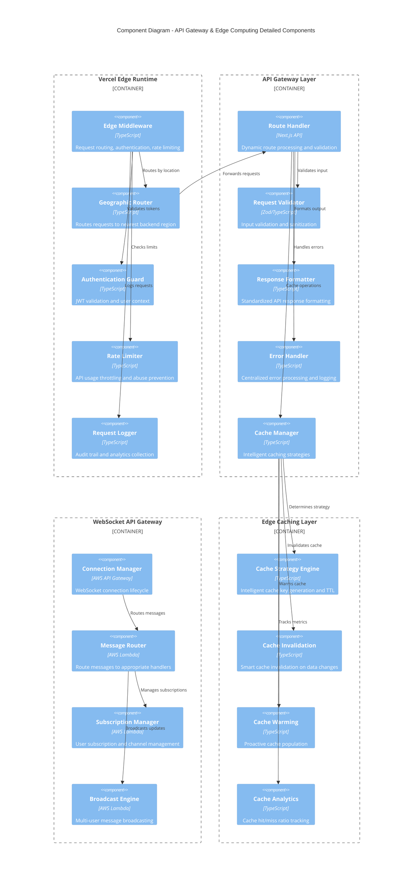
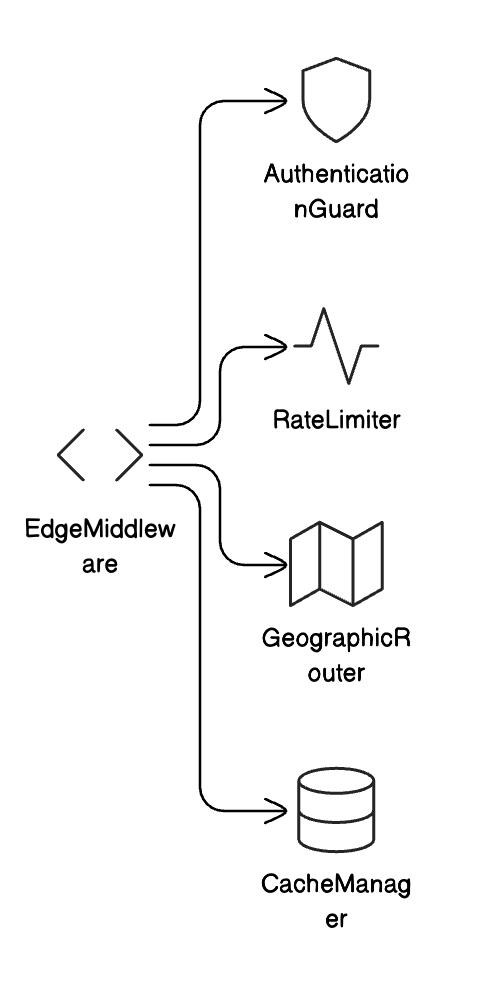

# LTI - ATS the ATS of the future

## Descripción breve del software LTI - ATS
LTI - ATS delivers a significant leap forward in recruitment efficiency by integrating advanced AI agents at its core. Key differentiators:
- ✅ **Proactive AI Insights:** Instead of just responding, AI proactively delivers actionable recruitment insights, significantly improving decision-making.
- ✅ **Predictive Hiring Analytics:** Anticipates the best candidate matches and hiring outcomes using robust predictive modeling.
- ✅ **Natural Language Interaction:** Human-centric interactions make complex tasks feel conversational and intuitive.
- ✅ **Intelligent Scheduling:** Seamlessly manages interviews, drastically reducing manual coordination efforts.
- ✅ **Out-of-the-box Simplicity with Essential Customization:** Immediate usability combined with critical flexibility tailored to growth-stage startups.

## Explicación de las funciones principales
1. **Predictive Hiring Analytics:**
    - AI-based forecasting of candidate-job compatibility.
    - Predictive insights on hiring timelines and candidate success.

2. **Proactive AI Assistant:**
    - Natural-language AI provid- ing timely suggestions on candidate sourcing, hiring pipeline improvements, and talent attraction strategies.

3. **Intelligent Scheduling:**
    - Automated scheduling integrated with calendars (Google Calendar, Outlook) and video conferencing tools (Zoom).

4. **Automatic Candidate Screening:**
    - Automated parsing and intelligent filtering of resumes, LinkedIn profiles, and application data for quick pre-selection.

5. **Seamless Integration:**
    - Deep integration with LinkedIn, Zoom, Instagram, TikTok, G-Suite, and Microsoft 365 for frictionless workflow.

6. **Compliance and Data Security:**
    - Built-in adherence to GDPR and EU privacy standards.

## Añadir un diagrama Lean Canvas
### 📊 LTI - ATS Lean Canvas

| Problem                        | Customer Segments                |
| ------------------------------ | -------------------------------- |
| - Inefficient hiring workflows | - HR Teams in Series C+ Startups |
| - Poor predictive capabilities | - Talent Acquisition Leaders     |
| - Complexity of current ATS    |                                  |

| Unique Value Proposition                                       | Solution                                                                                         |
| -------------------------------------------------------------- | ------------------------------------------------------------------------------------------------ |
| - AI-powered predictive insights and proactive recommendations | AI-centric ATS with natural-language querying, intelligent scheduling, and seamless integrations |

| Unfair Advantage                                 | Channels                                     |
| ------------------------------------------------ | -------------------------------------------- |
| - Proprietary predictive algorithms              | - Direct outreach to Series C+ HR leaders    |
| - Out-of-the-box simplicity with high-quality UX | - Social Media (LinkedIn, Instagram, TikTok) |
|                                                  | - Webinars, Industry Events                  |

| Revenue Streams                     | Cost Structure                   |
| ----------------------------------- | -------------------------------- |
| - Monthly subscription (tier-based) | - AI and cloud infrastructure    |
| - Premium integrations/add-ons      | - Product development & support  |
|                                     | - Compliance and security audits |

| Key Metrics                   |
| ----------------------------- |
| - Customer acquisition        |
| - Churn rate                  |
| - Avg. Time to Hire reduction |

## 📌 Descripción de los 3 casos de uso principales

1. 🚀 **Optimizing High-Volume Hiring**
    - **Scenario:** Rapid growth requires numerous hires within tight deadlines.
    - **Solution:** The ATS uses predictive analytics to forecast hiring needs, automatically screens resumes, schedules initial Zoom interviews, and proactively recommends top candidates, reducing overall time-to-hire.

2. 🌟 **Proactive Talent Attraction Campaigns**
    - **Scenario:** Attracting niche talent through social media (Instagram, TikTok) campaigns.
    - **Solution:** AI agents proactively suggest optimal content and timing for talent attraction posts, measure their effectiveness, and guide follow-up actions, thereby boosting talent inflow.

3. 📅 **Intelligent Interview Coordination**
    - **Scenario:** HR teams spending excessive time managing interview logistics.
    - **Solution:** AI-driven intelligent scheduling coordinates interviews seamlessly across Zoom and calendars, automatically handling confirmations and adjustments, significantly reducing administrative overhead.

## Modelo de datos

```mermaid
erDiagram
    %% Core User Management
    Organizations ||--o{ Users : "employs"
    Organizations ||--o{ Jobs : "posts"
    Organizations ||--o{ Departments : "has"
    Users ||--o{ Jobs : "owns"
    Users ||--o{ Applications : "reviews"
    Users ||--o{ Interviews : "conducts"
    Users ||--o{ AI_Agent_Sessions : "initiates"
    
    %% Job and Application Management
    Jobs ||--o{ Applications : "receives"
    Jobs ||--o{ Job_Skills : "requires"
    Jobs ||--o{ Job_Stages : "follows"
    Jobs ||--o{ AI_Job_Analytics : "generates"
    Departments ||--o{ Jobs : "has_openings"
    
    %% Candidate and Application Pipeline
    Candidates ||--o{ Applications : "submits"
    Candidates ||--o{ Candidate_Skills : "possesses"
    Candidates ||--o{ Candidate_Experiences : "has"
    Candidates ||--o{ AI_Candidate_Scores : "receives"
    Applications ||--o{ Application_Stages : "progresses_through"
    Applications ||--o{ Interviews : "includes"
    Applications ||--o{ AI_Application_Analysis : "analyzed_by"
    
    %% Interview and Feedback System
    Interviews ||--o{ Interview_Feedback : "receives"
    Interviews ||--o{ AI_Interview_Analysis : "analyzed_by"
    Application_Stages ||--o{ Stage_Feedback : "receives"
    Pipeline_Stages ||--o{ Application_Stages : "defines"
    Pipeline_Stages ||--o{ AI_Stage_Rules : "automated_by"
    
    %% Skills Management
    Skill_Categories ||--o{ Skills : "contains"
    Skills ||--o{ Job_Skills : "required_for"
    Skills ||--o{ Candidate_Skills : "possessed_by"
    Skill_Levels ||--o{ Job_Skills : "defines_requirement"
    Skill_Levels ||--o{ Candidate_Skills : "defines_proficiency"
    
    %% AI Agent System
    AI_Agents ||--o{ AI_Agent_Sessions : "executes"
    AI_Agents ||--o{ AI_Tasks : "performs"
    AI_Agent_Sessions ||--o{ AI_Tasks : "contains"
    AI_Tasks ||--o{ AI_Task_Results : "produces"
    
    %% Analytics and Intelligence
    Jobs ||--o{ Market_Intelligence : "informed_by"
    Applications ||--o{ Hiring_Analytics : "contributes_to"
    Organizations ||--o{ Diversity_Metrics : "tracks"
    
    %% Address and Location
    Candidates ||--o{ Addresses : "located_at"
    Jobs ||--o{ Addresses : "located_at"
    Organizations ||--o{ Addresses : "headquartered_at"

    %% Entity Definitions
    Organizations {
        uuid organization_id PK
        varchar name
        varchar industry
        int company_size
        varchar website
        varchar description
        timestamp created_at
        timestamp updated_at
        boolean is_active
    }

    Users {
        uuid user_id PK
        uuid organization_id FK
        varchar email
        varchar first_name
        varchar last_name
        varchar role "hiring_manager|recruiter|admin|interviewer"
        varchar password_hash
        timestamp last_login
        timestamp created_at
        boolean is_active
        jsonb permissions
    }

    Departments {
        uuid department_id PK
        uuid organization_id FK
        varchar name
        varchar description
        uuid manager_id FK
        timestamp created_at
    }

    Jobs {
        uuid job_id PK
        uuid organization_id FK
        uuid department_id FK
        uuid hiring_manager_id FK
        varchar title
        text description
        text requirements
        varchar employment_type "full_time|part_time|contract|intern"
        varchar work_mode "remote|hybrid|onsite"
        decimal salary_min
        decimal salary_max
        varchar currency
        varchar status "draft|active|paused|closed|cancelled"
        int positions_available
        timestamp posted_at
        timestamp deadline
        timestamp created_at
        timestamp updated_at
        jsonb ai_generated_content
        decimal ai_quality_score
    }

    Candidates {
        uuid candidate_id PK
        varchar email
        varchar first_name
        varchar last_name
        varchar phone
        varchar linkedin_url
        varchar github_url
        varchar portfolio_url
        text resume_text
        varchar resume_file_url
        timestamp created_at
        timestamp updated_at
        varchar source "job_board|referral|social|ai_sourcing|direct"
        jsonb ai_profile_summary
        decimal ai_overall_score
        boolean gdpr_consent
    }

    Applications {
        uuid application_id PK
        uuid job_id FK
        uuid candidate_id FK
        varchar status "applied|screening|interviewing|offered|hired|rejected|withdrawn"
        text cover_letter
        timestamp applied_at
        timestamp last_activity
        uuid current_stage_id FK
        decimal ai_match_score
        jsonb ai_screening_results
        varchar rejection_reason
        boolean is_ai_screened
    }

    Pipeline_Stages {
        uuid stage_id PK
        uuid organization_id FK
        varchar name
        varchar description
        int order_position
        varchar stage_type "screening|interview|assessment|reference|offer|onboarding"
        boolean is_required
        int estimated_duration_days
        boolean ai_automation_enabled
        jsonb ai_rules
    }

    Application_Stages {
        uuid application_stage_id PK
        uuid application_id FK
        uuid stage_id FK
        varchar status "pending|in_progress|completed|skipped"
        timestamp started_at
        timestamp completed_at
        uuid assigned_to FK
        text notes
        decimal ai_stage_score
        jsonb ai_recommendations
    }

    Interviews {
        uuid interview_id PK
        uuid application_id FK
        uuid interviewer_id FK
        varchar interview_type "phone|video|onsite|technical|cultural"
        timestamp scheduled_at
        int duration_minutes
        varchar status "scheduled|completed|cancelled|no_show"
        varchar meeting_link
        text notes
        decimal rating
        timestamp created_at
        boolean is_ai_analyzed
        jsonb ai_analysis_results
    }

    Interview_Feedback {
        uuid feedback_id PK
        uuid interview_id FK
        uuid interviewer_id FK
        decimal technical_rating
        decimal cultural_rating
        decimal communication_rating
        decimal overall_rating
        text strengths
        text concerns
        text recommendation "strong_hire|hire|no_hire|strong_no_hire"
        timestamp submitted_at
        jsonb structured_feedback
    }

    Stage_Feedback {
        uuid stage_feedback_id PK
        uuid application_stage_id FK
        uuid reviewer_id FK
        decimal rating
        text comments
        varchar decision "pass|fail|hold"
        timestamp created_at
        jsonb ai_sentiment_analysis
    }

    Skills {
        uuid skill_id PK
        uuid category_id FK
        varchar name
        varchar description
        varchar skill_type "technical|soft|language|certification"
        boolean is_verified
        timestamp created_at
    }

    Skill_Categories {
        uuid category_id PK
        varchar name
        varchar description
        varchar category_type "programming|design|management|communication"
        int priority_weight
    }

    Skill_Levels {
        uuid level_id PK
        varchar name "beginner|intermediate|advanced|expert"
        int numeric_value
        varchar description
    }

    Job_Skills {
        uuid job_skill_id PK
        uuid job_id FK
        uuid skill_id FK
        uuid required_level_id FK
        boolean is_required
        int importance_weight
        timestamp created_at
    }

    Candidate_Skills {
        uuid candidate_skill_id PK
        uuid candidate_id FK
        uuid skill_id FK
        uuid proficiency_level_id FK
        varchar verification_method "self_reported|tested|certified|verified"
        decimal ai_verified_score
        timestamp created_at
        timestamp verified_at
    }

    Candidate_Experiences {
        uuid experience_id PK
        uuid candidate_id FK
        varchar company_name
        varchar position_title
        text description
        date start_date
        date end_date
        boolean is_current
        varchar employment_type
        jsonb ai_extracted_skills
        decimal relevance_score
    }

    %% AI Agent System
    AI_Agents {
        uuid agent_id PK
        varchar agent_name
        varchar agent_type "sourcing|screening|scheduling|analytics|communication"
        varchar version
        jsonb capabilities
        jsonb configuration
        boolean is_active
        timestamp created_at
    }

    AI_Agent_Sessions {
        uuid session_id PK
        uuid agent_id FK
        uuid user_id FK
        varchar session_type "job_posting|candidate_sourcing|screening|interview_scheduling"
        jsonb input_parameters
        varchar status "running|completed|failed|cancelled"
        timestamp started_at
        timestamp completed_at
        jsonb session_results
    }

    AI_Tasks {
        uuid task_id PK
        uuid session_id FK
        uuid agent_id FK
        varchar task_type "parse_resume|score_candidate|generate_questions|schedule_interview"
        varchar status "queued|processing|completed|failed"
        jsonb input_data
        timestamp started_at
        timestamp completed_at
        int retry_count
    }

    AI_Task_Results {
        uuid result_id PK
        uuid task_id FK
        jsonb output_data
        decimal confidence_score
        varchar result_type "candidate_score|interview_questions|scheduling_options"
        timestamp created_at
        jsonb metadata
    }

    AI_Candidate_Scores {
        uuid score_id PK
        uuid candidate_id FK
        uuid job_id FK
        decimal overall_score
        decimal skills_match_score
        decimal experience_match_score
        decimal cultural_fit_score
        decimal success_probability
        jsonb score_breakdown
        varchar model_version
        timestamp calculated_at
        boolean is_current
    }

    AI_Application_Analysis {
        uuid analysis_id PK
        uuid application_id FK
        jsonb resume_analysis
        jsonb cover_letter_analysis
        jsonb skill_extraction
        jsonb experience_mapping
        decimal qualification_score
        varchar recommendation "auto_advance|manual_review|auto_reject"
        timestamp analyzed_at
        varchar model_version
    }

    AI_Interview_Analysis {
        uuid interview_analysis_id PK
        uuid interview_id FK
        jsonb sentiment_analysis
        jsonb communication_assessment
        jsonb technical_evaluation
        jsonb behavioral_indicators
        decimal ai_rating
        text ai_summary
        timestamp analyzed_at
    }

    AI_Job_Analytics {
        uuid job_analytics_id PK
        uuid job_id FK
        int applications_received
        decimal avg_candidate_quality
        int time_to_hire_days
        decimal offer_acceptance_rate
        jsonb sourcing_channel_performance
        jsonb bottleneck_analysis
        timestamp calculated_at
        varchar period "daily|weekly|monthly"
    }

    AI_Stage_Rules {
        uuid rule_id PK
        uuid stage_id FK
        varchar rule_type "auto_advance|auto_reject|flag_for_review"
        jsonb conditions
        jsonb actions
        boolean is_active
        int priority
        timestamp created_at
    }

    Market_Intelligence {
        uuid market_id PK
        uuid job_id FK
        varchar location
        varchar job_function
        varchar seniority_level
        decimal market_salary_min
        decimal market_salary_max
        decimal talent_availability_score
        int avg_time_to_hire
        jsonb salary_benchmarks
        jsonb skill_demand_trends
        timestamp data_date
        varchar data_source
    }

    Hiring_Analytics {
        uuid analytics_id PK
        uuid organization_id FK
        varchar metric_type "time_to_hire|cost_per_hire|source_effectiveness|diversity"
        decimal metric_value
        jsonb metric_breakdown
        date period_start
        date period_end
        timestamp calculated_at
    }

    Diversity_Metrics {
        uuid diversity_id PK
        uuid organization_id FK
        varchar demographic_category "gender|ethnicity|age|education|location"
        jsonb candidate_distribution
        jsonb hire_distribution
        jsonb pipeline_distribution
        date period_start
        date period_end
        timestamp calculated_at
    }

    Addresses {
        uuid address_id PK
        varchar country
        varchar state_province
        varchar city
        varchar postal_code
        varchar address_line_1
        varchar address_line_2
        decimal latitude
        decimal longitude
        varchar timezone
        boolean is_remote_friendly
    }
```


## Diseño del sistema a alto nivel

# AI-Powered ATS Jamstack Architecture

## Architecture Overview

This design follows the Jamstack pattern with your specified tech stack, optimizing for AI agent operations, scalability, and developer productivity within your 8-week MVP timeline.

## Architecture Diagram

```mermaid
graph TB
    subgraph "Frontend Layer (Jamstack)"
        UI[Next.js 14 App Router]
        UI --> |SSG/SSR| CDN[Vercel CDN]
        UI --> |Real-time| WS[WebSocket Connection]
        UI --> |Authentication| AUTH[Auth0 SDK]
    end

    subgraph "API Gateway & Edge"
        EDGE[Vercel Edge Functions]
        API[Next.js API Routes]
        EDGE --> API
        CDN --> EDGE
    end

    subgraph "Authentication & Authorization"
        AUTH0[Auth0 Service]
        AUTH --> AUTH0
        API --> AUTH0
    end

    subgraph "Core Backend Services (AWS Lambda)"
        CORE[Core API Lambda]
        AI_ORCHESTRATOR[AI Orchestrator Lambda]
        JOBS[Jobs Service Lambda]
        CANDIDATES[Candidates Service Lambda]
        APPLICATIONS[Applications Service Lambda]
        ANALYTICS[Analytics Service Lambda]
        
        API --> CORE
        CORE --> JOBS
        CORE --> CANDIDATES
        CORE --> APPLICATIONS
        CORE --> ANALYTICS
    end

    subgraph "AI Agent Layer (LangGraph + MCP)"
        MASTER_AGENT[Master Recruitment Agent]
        SCREENING_AGENT[Screening Agent]
        COORDINATION_AGENT[Coordination Agent]
        ANALYTICS_AGENT[Analytics Agent]
        
        AI_ORCHESTRATOR --> MASTER_AGENT
        MASTER_AGENT --> SCREENING_AGENT
        MASTER_AGENT --> COORDINATION_AGENT
        MASTER_AGENT --> ANALYTICS_AGENT
    end

    subgraph "LLM & AI Services"
        LANGCHAIN[LangChain Hub]
        OPENAI[OpenAI GPT-4]
        ANTHROPIC[Anthropic Claude]
        VECTOR_DB[Pinecone Vector DB]
        
        SCREENING_AGENT --> LANGCHAIN
        LANGCHAIN --> OPENAI
        LANGCHAIN --> ANTHROPIC
        SCREENING_AGENT --> VECTOR_DB
    end

    subgraph "Data Layer"
        POSTGRES[(PostgreSQL RDS)]
        REDIS[(Redis ElastiCache)]
        S3[AWS S3 Storage]
        
        CORE --> POSTGRES
        CORE --> REDIS
        JOBS --> POSTGRES
        CANDIDATES --> POSTGRES
        APPLICATIONS --> POSTGRES
        ANALYTICS --> POSTGRES
        
        CANDIDATES --> S3
        APPLICATIONS --> S3
    end

    subgraph "External Integrations"
        JOB_BOARDS[Job Boards APIs]
        EMAIL[SendGrid/SES]
        CALENDAR[Google Calendar API]
        LINKEDIN[LinkedIn API]
        
        COORDINATION_AGENT --> EMAIL
        COORDINATION_AGENT --> CALENDAR
        MASTER_AGENT --> JOB_BOARDS
        SCREENING_AGENT --> LINKEDIN
    end

    subgraph "Real-time & Background Processing"
        SQS[AWS SQS]
        EVENTBRIDGE[AWS EventBridge]
        WEBSOCKET[WebSocket API Gateway]
        
        AI_ORCHESTRATOR --> SQS
        ANALYTICS --> EVENTBRIDGE
        WEBSOCKET --> WS
        CORE --> WEBSOCKET
    end

    subgraph "Monitoring & Observability"
        CLOUDWATCH[CloudWatch]
        SENTRY[Sentry]
        DATADOG[DataDog]
        
        CORE --> CLOUDWATCH
        UI --> SENTRY
        AI_ORCHESTRATOR --> DATADOG
    end

    style UI fill:#e1f5fe
    style CDN fill:#e8f5e8
    style POSTGRES fill:#fff3e0
    style AI_ORCHESTRATOR fill:#f3e5f5
    style MASTER_AGENT fill:#e8eaf6
```





## C4 Architecture Diagram - API Gateway & Edge Computing Layer

### Level 1: System Context Diagram





### Level 2: Container Diagram





### Level 3: Component Diagram





### Level 4: Code Diagram - Critical Components



```mermaid
C4Code
    title Code Diagram - Edge Middleware Implementation

    class EdgeMiddleware {
        +handleRequest(request: Request): Response
        +authenticateUser(token: string): UserContext
        +checkRateLimit(userId: string): boolean
        +routeToRegion(request: Request): string
        +logRequest(request: Request, response: Response): void
    }

    class AuthenticationGuard {
        +validateJWT(token: string): JWTPayload
        +extractUserContext(payload: JWTPayload): UserContext
        +checkPermissions(user: UserContext, resource: string): boolean
        +refreshToken(token: string): string
    }

    class RateLimiter {
        +checkLimit(key: string, limit: number, window: number): boolean
        +incrementCounter(key: string): number
        +getWindowUsage(key: string): number
        +resetWindow(key: string): void
    }

    class GeographicRouter {
        +determineRegion(request: Request): string
        +getLatency(region: string): number
        +routeRequest(request: Request, region: string): Request
        +healthCheck(region: string): boolean
    }

    class CacheManager {
        +get(key: string): Promise<any>
        +set(key: string, value: any, ttl: number): Promise<void>
        +invalidate(pattern: string): Promise<void>
        +generateKey(request: Request): string
    }

    EdgeMiddleware --> AuthenticationGuard
    EdgeMiddleware --> RateLimiter
    EdgeMiddleware --> GeographicRouter
    EdgeMiddleware --> CacheManager
```
